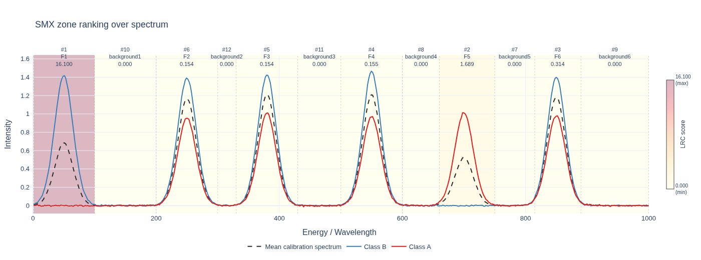
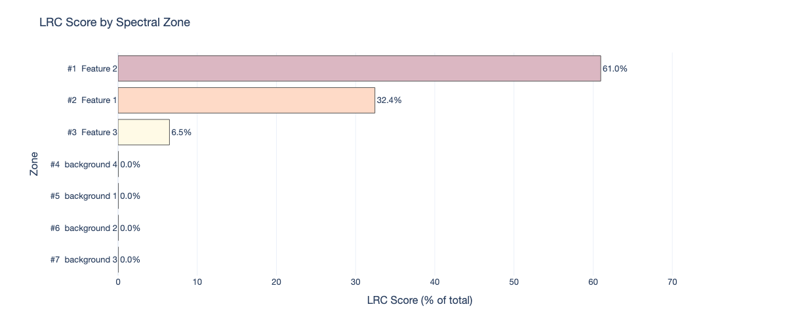
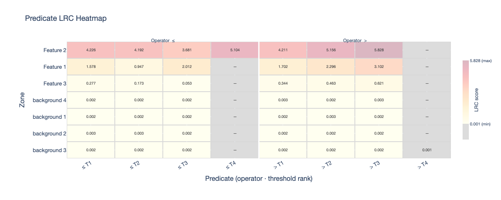
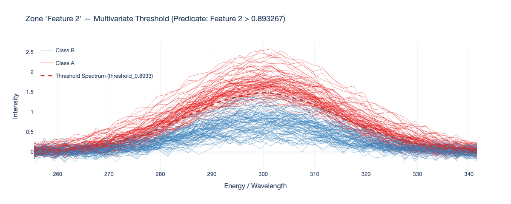
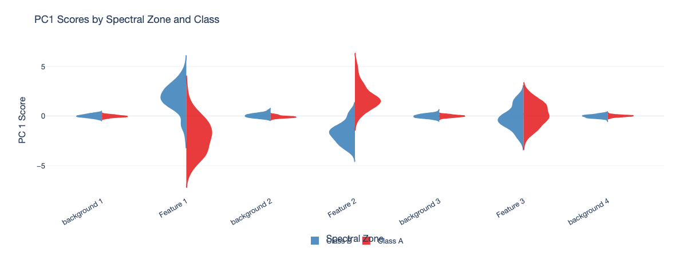
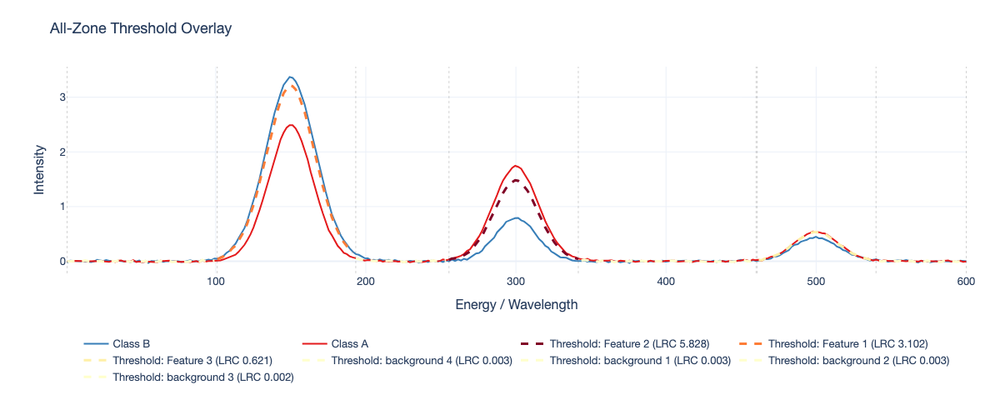

# Plotting gallery

SMX ships Plotly-based visualization helpers for every major output. Install
plotting dependencies with:

```bash
pip install "spectral-model-explainer[plotting]"
```

## Zone ranking over spectrum

Highlights the LRC-ranked zones on top of a reference spectrum.



```python
from smx import plot_zone_ranking_over_spectrum

plot_zone_ranking_over_spectrum(
    zone_ranking_df=smx.lrc_natural_,
    spectral_cuts=spectral_cuts,
    reference_spectrum=smx.zones_natural_,
    output_path="zone_ranking.html",
)
```

## LRC bar chart

Horizontal bar chart of LRC scores per zone.



```python
from smx import plot_lrc_bar

plot_lrc_bar(
    zone_ranking_df=smx.lrc_natural_,
    output_path="lrc_bar.html",
)
```

## Predicate heatmap

Heatmap of LRC scores across thresholds within each zone.



```python
from smx import plot_predicate_heatmap

plot_predicate_heatmap(
    lrc_natural_df=smx.lrc_natural_,
    output_path="predicate_heatmap.html",
)
```

## Threshold spectrum

Reconstructs a predicate threshold into the original spectral domain.



```python
from smx import plot_threshold_spectrum

plot_threshold_spectrum(
    lrc_natural_df=smx.lrc_natural_,
    row_index=0,
    spectral_zones_original=smx.zones_natural_,
    pca_info_dict_original=smx.pca_info_natural_,
    y_labels=y_cal,
    output_path="threshold.html",
)
```

## Zone scores

Split-violin plot of PCA scores per zone, grouped by class.



```python
from smx import plot_zone_scores

plot_zone_scores(
    zones=smx.zones_natural_,
    y_labels=y_cal,
    output_path="zone_scores.html",
)
```

## All thresholds overlay

Overlay of all top-ranked thresholds across the full spectrum.



```python
from smx import plot_all_thresholds_overlay

plot_all_thresholds_overlay(
    lrc_natural_df=smx.lrc_natural_,
    zones_natural=smx.zones_natural_,
    pca_info_natural=smx.pca_info_natural_,
    y_labels=y_cal,
    spectral_cuts=spectral_cuts,
    output_path="all_thresholds.html",
)
```

## Faithfulness curve

Progressive masking curve with AUC shading.


```python
from smx import plot_faithfulness_curve

plot_faithfulness_curve(
    faithfulness_result=smx.faithfulness_,
    output_path="faithfulness.html",
)
```

## Theme customization

All plots accept the `SMXTheme` object:

```python
from smx import SMXTheme, DEFAULT_THEME

custom = SMXTheme(font_family="Georgia, serif", colorscale="Blues")
plot_zone_ranking_over_spectrum(
    zone_ranking_df=smx.lrc_natural_,
    spectral_cuts=spectral_cuts,
    reference_spectrum=smx.zones_natural_,
    output_path="zone_ranking.html",
    theme=custom,
)
```
