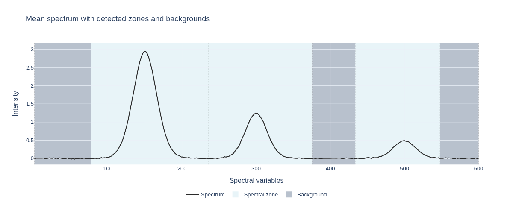
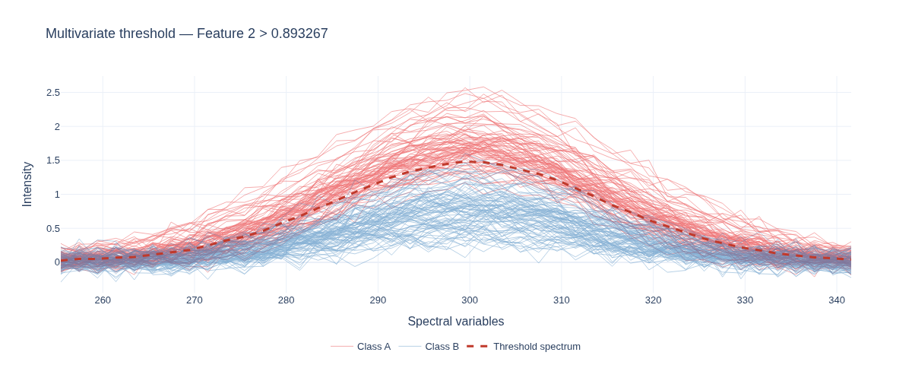
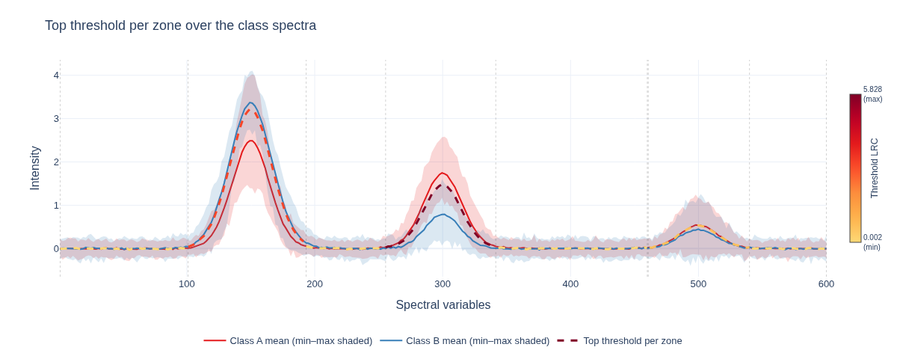
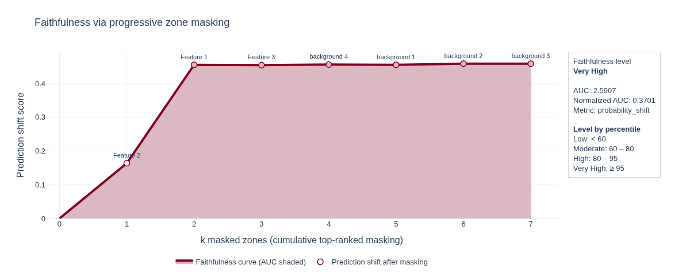

# Plotting gallery

SMX ships Plotly-based visualization helpers for every major output. Install
plotting dependencies with:

```bash
pip install "spectral-model-explainer[plotting]"
pip install kaleido  # only needed for static image export (.png, .svg, .pdf)
```

## Conventions

All plot functions share one contract:

- Data arguments come first; all other arguments are **keyword-only**.
- They **return a `plotly.graph_objects.Figure`** and never display it on their
  own. In Jupyter the returned figure renders automatically; in a script call
  `fig.show()`. Customise it further with `fig.update_layout(...)`.
- `return_df=True` returns `(fig, data)`, where `data` is the table the figure
  was built from. In Jupyter a bare call renders both.
- `output_path=None` writes nothing. Otherwise the format follows the suffix:
  `.html` (interactive) or `.png` / `.jpg` / `.webp` / `.svg` / `.pdf` (static).
- `title=None` uses the default title and `title=""` removes it.
- `width` / `height` size the figure for display *and* export.
- `class_colors` and `colorscale` override the corresponding `theme` fields.

```python
from smx import plot_lrc_bar

fig = plot_lrc_bar(smx.lrc_natural_)
fig.update_layout(title="LRC share per zone")
fig.write_image("lrc_bar.pdf")

fig, ranking = plot_lrc_bar(smx.lrc_natural_, return_df=True)
```

## Zone ranking over spectrum

Highlights the LRC-ranked zones on top of a reference spectrum.


```python
from smx import plot_zone_ranking_over_spectrum

fig = plot_zone_ranking_over_spectrum(
    smx.lrc_natural_,
    spectral_cuts,
    smx.zones_natural_,
    class_spectra={"A": X_cal[y_cal == "A"], "B": X_cal[y_cal == "B"]},
)

# or, from a fitted SMX explainer
fig = smx.plot_zone_ranking_over_spectrum(X_natural=X_cal, y_labels=y_cal)
```

## Spectrum with zones

Shades spectral zones and backgrounds (e.g. detected by
`building_spectral_zones`) behind a spectrum.



```python
from smx import building_spectral_zones, plot_spectrum_with_zones

cuts = building_spectral_zones(X_cal, prominence=0.3)
fig = plot_spectrum_with_zones(X_cal, cuts)
```

## LRC bar chart

Horizontal bar chart of LRC scores per zone.


```python
from smx import plot_lrc_bar

fig = plot_lrc_bar(smx.lrc_natural_)
```

## Predicate heatmap

Heatmap of LRC scores across thresholds within each zone.


```python
from smx import plot_predicate_heatmap

fig = plot_predicate_heatmap(smx.lrc_natural_)
```

## Threshold spectrum

Reconstructs a predicate threshold into the original spectral domain.



```python
from smx import plot_threshold_spectrum

fig = plot_threshold_spectrum(
    smx.lrc_natural_,
    0,                       # positional row of lrc_natural_
    smx.zones_natural_,
    smx.pca_info_natural_,
    y_cal,
)
```

## Zone scores

Split-violin plot of PCA scores per zone, grouped by class.


```python
from smx import plot_zone_scores

fig = plot_zone_scores(smx.zones_natural_, y_cal)
```

## All thresholds overlay

Overlay of all top-ranked thresholds across the full spectrum.



```python
from smx import plot_all_thresholds_overlay

fig = plot_all_thresholds_overlay(
    smx.lrc_natural_,
    smx.zones_natural_,
    smx.pca_info_natural_,
    y_cal,
    spectral_cuts,
)
```

## Faithfulness curve

Progressive masking curve with AUC shading.



```python
from smx import plot_faithfulness_curve

fig = plot_faithfulness_curve(smx.faithfulness_, output_path="faithfulness.html")

# or, from a fitted SMX explainer
fig = smx.plot_faithfulness(show_percentile=True)
```

## Theme customization

All plots accept the `SMXTheme` object:

```python
from smx import SMXTheme, DEFAULT_THEME

custom = SMXTheme(font_family="Georgia, serif", colorscale="Blues")
fig = plot_zone_ranking_over_spectrum(
    smx.lrc_natural_,
    spectral_cuts,
    smx.zones_natural_,
    theme=custom,
)
```

## Migrating from earlier versions

- Plot functions used to call `fig.show()` and return `None` (or only the data
  with `return_df=True`). They now return the figure, or `(fig, data)`.
- `output_path` is keyword-only and optional everywhere.
- `width` / `height` now size the displayed figure as well as exports.
- `plot_threshold_spectrum`: `spectral_zones_original` → `zones_natural`,
  `pca_info_dict_original` → `pca_info_natural` (old names still work with a
  `FutureWarning`).
- `building_spectral_zones`: `ploting` → `plotting` (now `False` by default),
  `_show_minima` → `show_minima` (old names still work with a `FutureWarning`).
