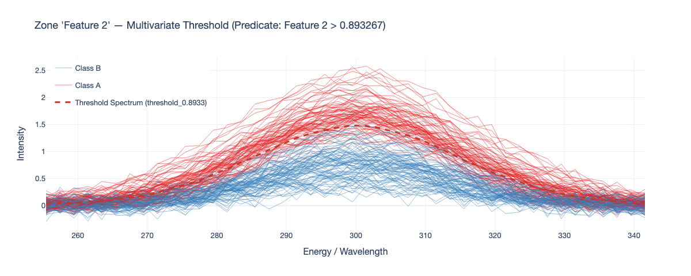
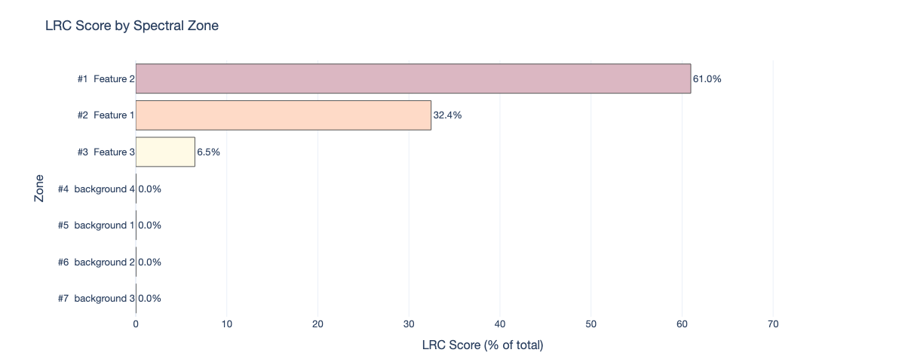
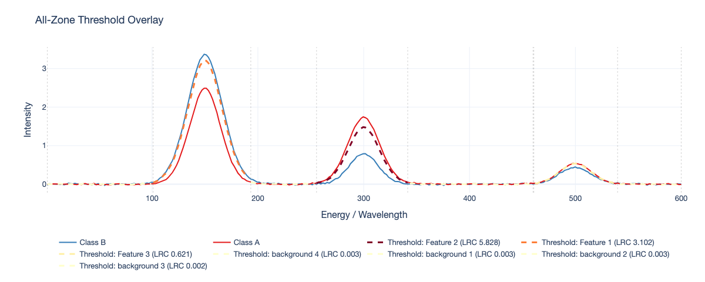
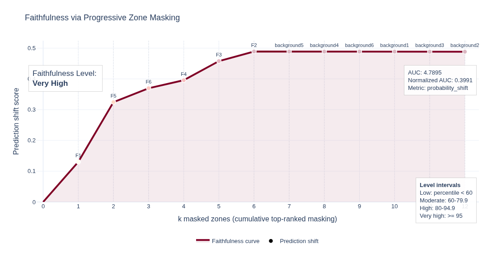

# SMX Plotting Gallery

All SMX plotting helpers share a unified visual theme controlled by
[`SMXTheme`](#smxtheme--visual-theme).  Pass a custom theme to any function
to override fonts, colors, and line styles consistently across all figures.

---

## `plot_zone_ranking_over_spectrum`

Overlays LRC-ranked spectral zones as colored bands on top of one or more
reference spectra.  A vertical colorbar on the right maps band color to LRC
score.  Outputs an interactive HTML figure or a static image depending on the
file extension of `output_path`.


### Minimal usage

```python
from smx import plot_zone_ranking_over_spectrum

plot_zone_ranking_over_spectrum(
    zone_ranking_df=explainer.lrc_natural_,
    spectral_cuts=spectral_cuts,
    reference_spectrum=explainer.zones_natural_,
    output_path="zone_ranking.html",
)
```

### With per-class mean spectra

```python
plot_zone_ranking_over_spectrum(
    zone_ranking_df=explainer.lrc_natural_,
    spectral_cuts=spectral_cuts,
    reference_spectrum=explainer.zones_natural_,
    output_path="zone_ranking.html",
    spectrum_name="Mean calibration spectrum",
    class_spectra={
        "A": X_cal[y_cal == "A"],
        "B": X_cal[y_cal == "B"],
    },
    class_colors={"A": "#e41a1c", "B": "#377eb8"},
)
```

### Static PNG export (requires `kaleido`)

```python
plot_zone_ranking_over_spectrum(
    zone_ranking_df=explainer.lrc_natural_,
    spectral_cuts=spectral_cuts,
    reference_spectrum=explainer.zones_natural_,
    output_path="zone_ranking.png",   # .png / .svg / .pdf
    width=1400,
    height=520,
)
```

### Via the `SMX` convenience method

```python
explainer.plot_zone_ranking_over_spectrum(
    "zone_ranking.html",
    ranking="natural",          # or "unique"
    X_natural=X_cal,
    y_labels=y_cal,
    class_colors={"A": "#e41a1c", "B": "#377eb8"},
)
```

**Key parameters**

| Parameter | Default | Description |
|---|---|---|
| `zone_ranking_df` | — | LRC table or `zone/score/rank` DataFrame |
| `spectral_cuts` | — | Zone boundary definitions |
| `reference_spectrum` | — | Overall mean spectrum (Series, DataFrame, or zone dict) |
| `output_path` | — | `.html` for interactive, `.png/.svg/.pdf` for static |
| `aggregation` | `"mean"` | Row aggregation when input is a DataFrame |
| `colorscale` | theme | Plotly colorscale name for zone bands |
| `class_spectra` | `None` | Per-class spectra dict to overlay as solid lines |
| `class_colors` | theme | Per-class hex/CSS colors |
| `width` / `height` | `1200` / `500` | Pixel dimensions for static export |
| `theme` | `DEFAULT_THEME` | `SMXTheme` instance |

---

## `plot_threshold_spectrum`

Reconstructs a predicate threshold from PCA space back into the original
spectral domain and overlays it on individual calibration spectra colored by
class.



### Usage

```python
from smx.plotting import plot_threshold_spectrum

# Get the top-ranked predicate index
row_index = explainer.lrc_natural_.index[
    explainer.lrc_natural_["Node"] == top_per_zone.iloc[0]["Node"]
].tolist()[0]

plot_threshold_spectrum(
    lrc_natural_df=explainer.lrc_natural_,
    row_index=row_index,
    spectral_zones_original=explainer.zones_natural_,
    pca_info_dict_original=explainer.pca_info_natural_,
    y_labels=y_cal,
    output_path="threshold_Feature1.html",
    class_colors={"A": "#e41a1c", "B": "#377eb8"},
)
```

### Loop over all top-ranked predicates

```python
top_per_zone = (
    explainer.lrc_natural_[explainer.lrc_natural_["Zone"].notna()]
    .sort_values("Local_Reaching_Centrality", ascending=False)
    .drop_duplicates(subset=["Zone"])
)

for _, row in top_per_zone.iterrows():
    row_index = explainer.lrc_natural_.index[
        explainer.lrc_natural_["Node"] == row["Node"]
    ].tolist()[0]
    plot_threshold_spectrum(
        lrc_natural_df=explainer.lrc_natural_,
        row_index=row_index,
        spectral_zones_original=explainer.zones_natural_,
        pca_info_dict_original=explainer.pca_info_natural_,
        y_labels=y_cal,
        output_path=f"threshold_{row['Zone']}.html",
    )
```

**Key parameters**

| Parameter | Default | Description |
|---|---|---|
| `lrc_natural_df` | — | `explainer.lrc_natural_` |
| `row_index` | — | Integer row index of the predicate to plot |
| `spectral_zones_original` | — | `explainer.zones_natural_` |
| `pca_info_dict_original` | — | `explainer.pca_info_natural_` |
| `y_labels` | — | Class label Series aligned with calibration rows |
| `output_path` | — | Destination `.html` file |
| `class_colors` | theme | Per-class hex/CSS color mapping |
| `width` / `height` | `900` / `450` | Pixel dimensions for static export |
| `theme` | `DEFAULT_THEME` | `SMXTheme` instance |

---

## `plot_lrc_bar`

Horizontal bar chart ranking spectral zones by their maximum LRC score.
Bar colors follow the same colorscale as the zone-ranking plot, making the
two figures directly comparable at a glance.



### Usage

```python
from smx import plot_lrc_bar

plot_lrc_bar(
    zone_ranking_df=explainer.lrc_natural_,
    output_path="lrc_bar.html",
    title="LRC Score by Spectral Zone",
)
```

**Key parameters**

| Parameter | Default | Description |
|---|---|---|
| `zone_ranking_df` | — | LRC table or `zone/score/rank` DataFrame |
| `output_path` | — | `.html` for interactive, `.png/.svg/.pdf` for static |
| `colorscale` | theme | Plotly colorscale for bar colors |
| `width` / `height` | `800` / `500` | Pixel dimensions for static export |
| `theme` | `DEFAULT_THEME` | `SMXTheme` instance |

---

## `plot_predicate_heatmap`

Heatmap of LRC scores across every zone–predicate combination.  Rows are
zones (highest LRC at top), columns are predicates grouped by operator
(`≤` then `>`) and sorted by threshold rank within each group.  Grey cells
indicate predicates absent from that zone.


### Usage

```python
from smx import plot_predicate_heatmap

plot_predicate_heatmap(
    lrc_natural_df=explainer.lrc_natural_,
    output_path="predicate_heatmap.html",
)
```

**Key parameters**

| Parameter | Default | Description |
|---|---|---|
| `lrc_natural_df` | — | `explainer.lrc_natural_` |
| `output_path` | — | Destination file |
| `colorscale` | theme | Plotly colorscale for cell colors |
| `width` / `height` | `1000` / `550` | Pixel dimensions for static export |
| `theme` | `DEFAULT_THEME` | `SMXTheme` instance |

---

## `plot_zone_scores`

Split-violin plot of PC1 scores per spectral zone, split by class.  For
exactly two classes the violins are mirrored; for three or more they overlap.
This directly shows where class distributions separate in compressed spectral
space.


### Usage

```python
from smx import plot_zone_scores

# From the SMX zone dict (recommended)
plot_zone_scores(
    zones=explainer.zones_natural_,
    y_labels=y_cal,
    output_path="zone_scores.html",
    class_colors={"A": "#e41a1c", "B": "#377eb8"},
)

# From the raw calibration DataFrame
plot_zone_scores(
    zones=X_cal,
    y_labels=y_cal,
    spectral_cuts=spectral_cuts,
    output_path="zone_scores.html",
)
```

**Key parameters**

| Parameter | Default | Description |
|---|---|---|
| `zones` | — | `smx.zones_natural_` dict or full calibration DataFrame |
| `y_labels` | — | Class label Series |
| `spectral_cuts` | `None` | Required when `zones` is a DataFrame |
| `class_colors` | theme | Per-class hex/CSS colors |
| `width` / `height` | `1200` / `580` | Pixel dimensions for static export |
| `theme` | `DEFAULT_THEME` | `SMXTheme` instance |

---

## `plot_all_thresholds_overlay`

Full-spectrum overlay combining mean class spectra (solid) with the
top-ranked predicate threshold for every zone (dashed).  Threshold line
colors follow the LRC colorscale so the most influential zones visually
dominate.  This gives a complete, single-figure summary of where and how the
model draws its decision boundaries across the entire spectral axis.



### Usage

```python
from smx import plot_all_thresholds_overlay

plot_all_thresholds_overlay(
    lrc_natural_df=explainer.lrc_natural_,
    zones_natural=explainer.zones_natural_,
    pca_info_natural=explainer.pca_info_natural_,
    y_labels=y_cal,
    spectral_cuts=spectral_cuts,
    output_path="all_thresholds.html",
    class_colors={"A": "#e41a1c", "B": "#377eb8"},
)
```

**Key parameters**

| Parameter | Default | Description |
|---|---|---|
| `lrc_natural_df` | — | `explainer.lrc_natural_` |
| `zones_natural` | — | `explainer.zones_natural_` |
| `pca_info_natural` | — | `explainer.pca_info_natural_` |
| `y_labels` | — | Class label Series |
| `spectral_cuts` | — | Zone boundary definitions |
| `class_colors` | theme | Per-class hex/CSS colors |
| `width` / `height` | `1200` / `500` | Pixel dimensions for static export |
| `theme` | `DEFAULT_THEME` | `SMXTheme` instance |

---

## `plot_faithfulness_curve`

Visualizes the progressive masking faithfulness diagnostic as a prediction-shift
curve over cumulative top-`k` masked zones. The trapezoidal AUC is shaded, and
the figure annotates the AUC, normalized AUC, categorical level, and percentile
against the random-ordering baseline.




### Usage

```python
from smx import plot_faithfulness_curve

faithfulness = explainer.evaluate_faithfulness(
    X_test_prep,
    ranking="unique",
    masking_strategy="zero",
    output_path="faithfulness_curve.html",
)

print(faithfulness["auc"], faithfulness["level"], faithfulness.get("plot_path"))
```

### Via the `SMX` convenience method

```python
explainer.evaluate_faithfulness(X_test_prep)
explainer.plot_faithfulness("faithfulness_curve.html")
```

**Key parameters**

| Parameter | Default | Description |
|---|---|---|
| `faithfulness_result` | — | Output of `evaluate_faithfulness()` |
| `output_path` | — | `.html` for interactive, `.png/.svg/.pdf` for static |
| `width` / `height` | `1100` / `560` | Pixel dimensions for static export |
| `theme` | `DEFAULT_THEME` | `SMXTheme` instance |

---


## `SMXTheme` — Visual Theme

All plot functions accept a `theme` keyword argument of type `SMXTheme`.
Explicit style parameters (e.g. `class_colors`, `colorscale`) always take
precedence over the theme.

```python
from smx import SMXTheme, DEFAULT_THEME

# Inspect defaults
print(DEFAULT_THEME)

# Create a custom theme
my_theme = SMXTheme(
    template="simple_white",
    font_family="Georgia, serif",
    font_size=15,
    colorscale="Blues",
    class_colors={"A": "#d62728", "B": "#1f77b4"},
    threshold_color="#2ca02c",
    zone_opacity=0.20,
)

# Apply to any plot
plot_zone_ranking_over_spectrum(
    ...,
    output_path="zone_ranking.html",
    theme=my_theme,
)
```

### Theme fields

| Field | Default | Description |
|---|---|---|
| `template` | `"plotly_white"` | Plotly layout template |
| `font_family` | `"Inter, Helvetica Neue, Arial, sans-serif"` | CSS font stack |
| `font_size` | `13` | Base font size (px) |
| `class_colors` | `{"A": "#e41a1c", "B": "#377eb8", ...}` | Per-class color map |
| `fallback_palette` | 8-color list | Used for unlisted class labels |
| `colorscale` | `"YlOrRd"` | Plotly colorscale for LRC zone bands |
| `zone_opacity` | `0.28` | Zone background rectangle opacity |
| `reference_line_color` | `"#2b2b2b"` | Overall mean spectrum line color |
| `reference_line_width` | `2` | Overall mean spectrum line width (px) |
| `reference_line_dash` | `"dash"` | Plotly dash style for reference line |
| `class_line_width` | `2` | Per-class mean spectrum line width (px) |
| `threshold_color` | `"#c0392b"` | Threshold spectrum line color |
| `threshold_line_width` | `3` | Threshold spectrum line width (px) |
| `threshold_line_dash` | `"dash"` | Plotly dash style for threshold line |
| `zone_boundary_color` | `"rgba(80,80,80,0.25)"` | Zone separator line color |
| `zone_boundary_width` | `1` | Zone separator line width (px) |
| `zone_boundary_dash` | `"dot"` | Plotly dash style for zone boundaries |
| `colorbar_thickness` | `15` | LRC colorbar thickness (px) |
| `colorbar_len` | `0.75` | LRC colorbar length (fraction of plot height) |
| `annotation_font_size` | `11` | Zone label annotation font size (px) |
