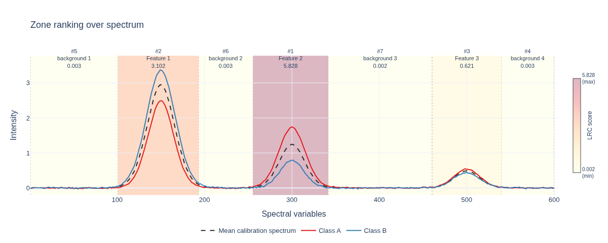
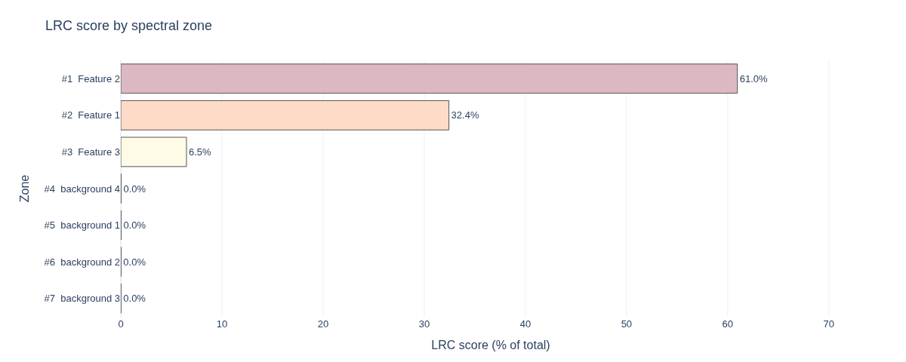
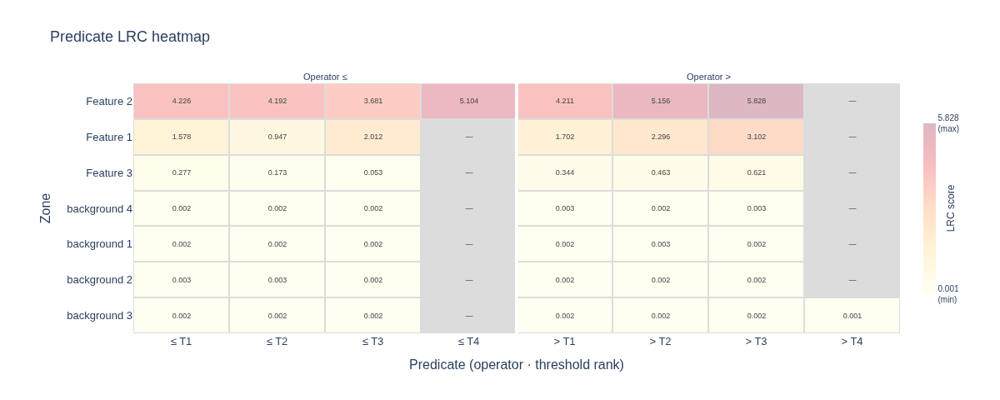
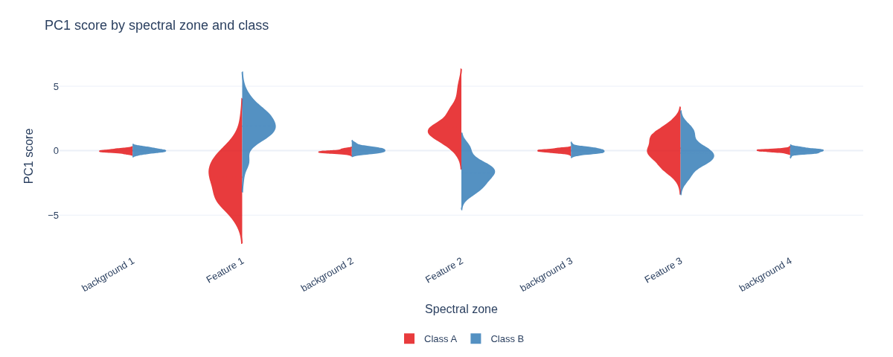

# SMX Plotting Gallery

All SMX plotting helpers share a unified visual theme controlled by
[`SMXTheme`](#smxtheme--visual-theme).  Pass a custom theme to any function
to override fonts, colors, and line styles consistently across all figures.

## Conventions shared by every plot function

* Data arguments come first; all other arguments are **keyword-only**.
* Every function **returns a `plotly.graph_objects.Figure`** and never displays
  it on its own: in Jupyter the returned figure renders automatically, in a
  script call `fig.show()`. The figure can be customised further with
  `fig.update_layout(...)` before showing or saving it.
* `return_df=True` returns `(fig, data)` instead, where `data` is the table the
  figure was built from. In Jupyter a bare call renders both.
* `output_path=None` writes nothing; otherwise the format is inferred from the
  suffix: `.html` (interactive) or `.png` / `.jpg` / `.webp` / `.svg` / `.pdf`
  (static, requires `kaleido`). Missing parent folders are created.
* `title=None` uses the plot's default title, `title=""` removes it.
* `width` / `height` set the figure size in pixels for display *and* export.
* `class_colors` and `colorscale` override the corresponding `theme` fields.

```python
fig = plot_lrc_bar(explainer.lrc_natural_)            # returns the figure
fig.update_layout(title="My title")                   # customise freely
fig.write_image("lrc_bar.pdf")                        # or output_path=...
fig, ranking = plot_lrc_bar(explainer.lrc_natural_, return_df=True)
```

---

## `plot_zone_ranking_over_spectrum`

Overlays LRC-ranked spectral zones as colored bands on top of one or more
reference spectra.  A vertical colorbar on the right maps band color to LRC
score.  Outputs an interactive HTML figure or a static image depending on the
file extension of `output_path`.



### Minimal usage

```python
from smx import plot_zone_ranking_over_spectrum

fig = plot_zone_ranking_over_spectrum(
    explainer.lrc_natural_,
    spectral_cuts,
    explainer.zones_natural_,
    output_path="zone_ranking.html",  # optional
)
```

### With per-class mean spectra

```python
plot_zone_ranking_over_spectrum(
    zone_ranking_df=explainer.lrc_natural_,
    spectral_cuts=spectral_cuts,
    reference_spectrum=explainer.zones_natural_,
    output_path="zone_ranking.html",
    spectrum_name="Mean calibration spectrum",
    class_spectra={
        "A": X_cal[y_cal == "A"],
        "B": X_cal[y_cal == "B"],
    },
    class_colors={"A": "#e41a1c", "B": "#377eb8"},
)
```

### Static PNG export (requires `kaleido`)

```python
plot_zone_ranking_over_spectrum(
    zone_ranking_df=explainer.lrc_natural_,
    spectral_cuts=spectral_cuts,
    reference_spectrum=explainer.zones_natural_,
    output_path="zone_ranking.png",   # .png / .svg / .pdf
    width=1400,
    height=520,
)
```

### Via the `SMX` convenience method

```python
explainer.plot_zone_ranking_over_spectrum(
    "zone_ranking.html",
    ranking="natural",          # or "unique"
    X_natural=X_cal,
    y_labels=y_cal,
    class_colors={"A": "#e41a1c", "B": "#377eb8"},
)
```

**Key parameters**

| Parameter | Default | Description |
|---|---|---|
| `zone_ranking_df` | — | LRC table or `zone/score/rank` DataFrame |
| `spectral_cuts` | — | Zone boundary definitions |
| `reference_spectrum` | — | Overall mean spectrum (Series, DataFrame, or zone dict) |
| `output_path` | `None` | `.html` for interactive, `.png/.svg/.pdf` for static |
| `aggregation` | `"mean"` | Row aggregation when input is a DataFrame |
| `title` | `None` | Figure title |
| `spectrum_name` | `"Reference spectrum"` | Legend label for background spectrum |
| `colorscale` | theme | Plotly colorscale name for zone bands |
| `annotation_y` | `1.06` | Annotation y-position in paper coordinates |
| `class_spectra` | `None` | Per-class spectra dict to overlay as solid lines |
| `class_colors` | theme | Per-class hex/CSS colors |
| `width` / `height` | `1200` / `500` | Figure size in pixels |
| `theme` | `DEFAULT_THEME` | `SMXTheme` instance |
| `return_df` | `False` | If `True`, return `(fig, ranking_df)` with the normalised `zone/score/rank` table |

---

## `plot_spectrum_with_zones`

Plots a spectrum (a DataFrame or 2-D array is averaged over rows) with spectral zones
highlighted as shaded rectangular bands. Zone and background regions can be
styled independently. Optionally overlays markers for detected peaks and minima.


*Above: the cuts detected by `building_spectral_zones` drawn with
`plot_spectrum_with_zones` (`building_spectral_zones(..., plotting=True)`
displays the same figure).*

### Minimal usage

```python
from smx import plot_spectrum_with_zones

plot_spectrum_with_zones(
    spectrum=my_spectrum,
    spectral_cuts=spectral_cuts,
    output_path="spectrum_zones.html",
)
```

### With peaks and minima

```python
plot_spectrum_with_zones(
    spectrum=my_spectrum,
    spectral_cuts=spectral_cuts,
    identified_peaks=[120, 340, 580],
    identified_minima=[80, 250, 490],
    output_path="spectrum_zones.html",
)
```

### Static PNG export (requires `kaleido`)

```python
plot_spectrum_with_zones(
    spectrum=my_spectrum,
    spectral_cuts=spectral_cuts,
    output_path="spectrum_zones.png",
    width=1400,
    height=520,
)
```

**Key parameters**

| Parameter | Default | Description |
|---|---|---|
| `spectrum` | — | Spectrum as Series, DataFrame, or ndarray |
| `spectral_cuts` | — | Zone definitions as `(label, start, end)` tuples or dicts |
| `identified_peaks` | `None` | Indices of local maxima to mark on the plot |
| `identified_minima` | `None` | Indices of local minima to mark on the plot |
| `output_path` | `None` | `.html` for interactive, `.png/.svg/.pdf` for static |
| `zone_color` | `"rgb(173, 216, 230)"` | Light blue fill for spectral zones |
| `background_color` | `"rgb(0, 34, 75)"` | Dark blue fill for background zones |
| `zone_opacity` | theme | Opacity of the shaded regions |
| `width` / `height` | `1200` / `500` | Figure size in pixels |
| `theme` | `DEFAULT_THEME` | `SMXTheme` instance |
| `return_df` | `False` | If `True`, return `(fig, cuts_df)` with the parsed cuts |

---

## `plot_threshold_spectrum`

Reconstructs a predicate threshold from PCA space back into the original
spectral domain and overlays it on individual calibration spectra colored by
class.


### Usage

```python
from smx.plotting import plot_threshold_spectrum

fig = plot_threshold_spectrum(
    explainer.lrc_natural_,
    0,                              # positional row of lrc_natural_ (iloc)
    explainer.zones_natural_,
    explainer.pca_info_natural_,
    y_cal,
    class_colors={"A": "#e41a1c", "B": "#377eb8"},
)
```

### Loop over the top-ranked predicate of every zone

```python
lrc = explainer.lrc_natural_.reset_index(drop=True)
top_positions = (
    lrc[lrc["Zone"].notna()]
    .sort_values("Local_Reaching_Centrality", ascending=False)
    .drop_duplicates(subset=["Zone"])
    .index
)

for position in top_positions:
    plot_threshold_spectrum(
        lrc,
        position,
        explainer.zones_natural_,
        explainer.pca_info_natural_,
        y_cal,
        output_path=f"threshold_{lrc.loc[position, 'Zone']}.html",
    )
```

**Key parameters**

| Parameter | Default | Description |
|---|---|---|
| `lrc_natural_df` | — | `explainer.lrc_natural_` |
| `row_index` | — | Positional row (`iloc`) of `lrc_natural_df` to plot |
| `zones_natural` | — | `explainer.zones_natural_` (formerly `spectral_zones_original`, still accepted with a deprecation warning) |
| `pca_info_natural` | — | `explainer.pca_info_natural_` (formerly `pca_info_dict_original`) |
| `y_labels` | `None` | Class labels aligned row by row with the zones; all spectra share one colour when omitted |
| `output_path` | `None` | `.html` for interactive, `.png/.svg/.pdf` for static |
| `title` | `None` | Figure title (`""` removes it) |
| `class_colors` | theme | Per-class hex/CSS color mapping |
| `theme` | `DEFAULT_THEME` | `SMXTheme` instance |
| `width` / `height` | `900` / `450` | Figure size in pixels |
| `return_df` | `False` | If `True`, return `(fig, threshold_spectrum)` |

---

## `plot_lrc_bar`

Horizontal bar chart ranking spectral zones by their maximum LRC score.
Bar colors follow the same colorscale as the zone-ranking plot, making the
two figures directly comparable at a glance.



### Usage

```python
from smx import plot_lrc_bar

fig = plot_lrc_bar(explainer.lrc_natural_, output_path="lrc_bar.html")
```

**Key parameters**

| Parameter | Default | Description |
|---|---|---|
| `zone_ranking_df` | — | LRC table or `zone/score/rank` DataFrame |
| `output_path` | `None` | `.html` for interactive, `.png/.svg/.pdf` for static |
| `title` | `None` | Figure title |
| `colorscale` | theme | Plotly colorscale name for bar colors |
| `width` / `height` | `800` / `500` | Figure size in pixels |
| `theme` | `DEFAULT_THEME` | `SMXTheme` instance |
| `return_df` | `False` | If `True`, return `(fig, ranking_df)` with `zone/score/rank/pct` |

---

## `plot_predicate_heatmap`

Heatmap of LRC scores across every zone–predicate combination.  Rows are
zones (highest LRC at top), columns are predicates grouped by operator
(`≤` then `>`) and numbered by increasing threshold within each group.  Grey cells
indicate predicates absent from that zone.



### Usage

```python
from smx import plot_predicate_heatmap

fig = plot_predicate_heatmap(explainer.lrc_natural_)
```

**Key parameters**

| Parameter | Default | Description |
|---|---|---|
| `lrc_natural_df` | — | `explainer.lrc_natural_` |
| `output_path` | `None` | `.html` for interactive, `.png/.svg/.pdf` for static |
| `title` | `None` | Figure title |
| `colorscale` | theme | Plotly colorscale for cell colors |
| `width` / `height` | `1000` / `550` | Figure size in pixels |
| `theme` | `DEFAULT_THEME` | `SMXTheme` instance |
| `return_df` | `False` | If `True`, return `(fig, pivot)` (zones × predicates → LRC) |

---

## `plot_zone_scores`

Split-violin plot of PC1 scores per spectral zone, split by class.  For
exactly two classes the violins are mirrored; for three or more they are drawn
side by side.
This directly shows where class distributions separate in compressed spectral
space.



### Usage

```python
from smx import plot_zone_scores

# From the SMX zone dict (recommended)
fig = plot_zone_scores(
    explainer.zones_natural_,
    y_cal,
    class_colors={"A": "#e41a1c", "B": "#377eb8"},
)

# From the raw calibration DataFrame
fig = plot_zone_scores(X_cal, y_cal, spectral_cuts)

# Reusing an aggregator fitted elsewhere (e.g. on calibration data)
agg = ZoneAggregator(method="pca").fit(zones_cal)
fig = plot_zone_scores(zones_test, y_test, aggregator=agg)
```

**Key parameters**

| Parameter | Default | Description |
|---|---|---|
| `zones` | — | `smx.zones_natural_` dict or full calibration DataFrame |
| `y_labels` | — | Class label Series |
| `spectral_cuts` | `None` | Required when `zones` is a DataFrame |
| `aggregator` | `None` | Fitted `ZoneAggregator` to compute the scores (a PCA is fitted on `zones` when omitted) |
| `output_path` | `None` | `.html` for interactive, `.png/.svg/.pdf` for static |
| `title` | `None` | Figure title |
| `class_colors` | theme | Per-class hex/CSS colors |
| `width` / `height` | `1200` / `580` | Figure size in pixels |
| `theme` | `DEFAULT_THEME` | `SMXTheme` instance |
| `return_df` | `False` | If `True`, return `(fig, zone_scores_df)` |

---

## `plot_all_thresholds_overlay`

Full-spectrum overlay combining mean class spectra (solid, min–max envelope
shaded) with the top-ranked predicate threshold for every zone (dashed).
Threshold line colors follow the LRC colorscale (shown in a colorbar) so the
most influential zones visually dominate; hover a threshold to see its zone
and LRC.  This gives a complete, single-figure summary of where and how the
model draws its decision boundaries across the entire spectral axis.


### Usage

```python
from smx import plot_all_thresholds_overlay

fig = plot_all_thresholds_overlay(
    explainer.lrc_natural_,
    explainer.zones_natural_,
    explainer.pca_info_natural_,
    y_cal,
    spectral_cuts,
    class_colors={"A": "#e41a1c", "B": "#377eb8"},
)
```

**Key parameters**

| Parameter | Default | Description |
|---|---|---|
| `lrc_natural_df` | — | `explainer.lrc_natural_` |
| `zones_natural` | — | `explainer.zones_natural_` |
| `pca_info_natural` | — | `explainer.pca_info_natural_` |
| `y_labels` | — | Class label Series (`None` draws one mean spectrum over all samples) |
| `spectral_cuts` | — | Zone boundary definitions |
| `output_path` | `None` | `.html` for interactive, `.png/.svg/.pdf` for static |
| `title` | `None` | Figure title |
| `class_colors` | theme | Per-class hex/CSS colors |
| `colorscale` | theme | Colorscale for the threshold lines |
| `width` / `height` | `1200` / `500` | Figure size in pixels |
| `theme` | `DEFAULT_THEME` | `SMXTheme` instance |
| `return_df` | `False` | If `True`, return `(fig, top_per_zone)` |

---

## `plot_faithfulness_curve`

Visualizes the progressive masking faithfulness diagnostic as a prediction-shift
curve over cumulative top-`k` masked zones. The trapezoidal AUC is shaded, and
a panel to the right of the plot reports the categorical level, AUC,
normalized AUC, metric, the level intervals and (optionally) the percentile
against the random-ordering baseline.


### What is being evaluated

`evaluate_faithfulness` implements a **progressive masking** protocol. After an
SMX explainer is fitted, zones are masked one at a time in order of decreasing
LRC score and the classifier's output is recomputed at each step. The
prediction-shift curve tracks how the model's score degrades as informative
zones are removed. The **Area Under this Curve (AUC)** quantifies overall
faithfulness — a high AUC means top-ranked zones genuinely drive the
prediction; a low AUC means the ranking is no better than random.

**AUC normalisation** — the raw AUC is bounded by the number of zones and the
model's baseline accuracy. SMX normalises it to the **[0, 1] interval** by
dividing by the maximum achievable AUC (the AUC of a perfectly ordered ranking
that removes the least-informative zones first).

### Output fields

`evaluate_faithfulness` returns a dict with the following keys:

| Field | Type | Description |
|---|---|---|
| `auc` | float | Trapezoidal AUC of the masking curve (higher = more faithful) |
| `auc_normalized` | float | `auc` divided by the number of masked zones |
| `level` | str | Quality label (see table below) |
| `null_percentile` | float | Percentile of the true AUC against the AUCs of `n_random_rankings` (default 100) random orderings |
| `null_auc_distribution` | ndarray | AUC of each random ordering (useful for diagnostic histograms) |
| `null_auc_mean` / `null_auc_std` | float | Mean / standard deviation of the random-ordering AUCs |
| `curve_df` | DataFrame | Columns: `k`, `masked_zone`, `masked_zones`, `score` for each masking step |
| `n_masked_zones` | int | Number of zones masked |
| `metric` / `masking_strategy` | str | Settings used for the evaluation |
| `plot_path` | str | Path to the saved figure (when `output_path` is provided) |

**Quality levels** are assigned based on `null_percentile`:

| Level | Condition |
|-------|-----------|
| *Very High* | `null_percentile ≥ 95` |
| *High* | `80 ≤ null_percentile < 95` |
| *Moderate* | `60 ≤ null_percentile < 80` |
| *Low* | `null_percentile < 60` |

- **`null_percentile`** — percentile of the true AUC against a **null distribution** built by computing the AUC for `n_random_rankings` random zone orderings (default: 100). A percentile close to 100 means the LRC-based ranking is far better than random; a percentile near 50 means the ranking carries no more information than chance.

### Curve interpretation

- **Steep early drop** — the first few zones dominate the prediction; the
  explanation captures the core decision boundary
- **Gradual decline** — predictive power is distributed across many zones;
  the model relies on a broad spectral signature
- **Flat curve** — masking has little effect regardless of zone order;
  either the classifier is weak or the LRC ranking is misaligned with
  decision behaviour

### Usage

```python
from smx import plot_faithfulness_curve

faithfulness = explainer.evaluate_faithfulness(
    X_test_prep,
    ranking="unique",
    masking_strategy="zero",
    metric="auto",  # automatically selects "probability_shift", "decision_function_shift", or "mean_abs_diff" based on the estimator's available methods
    output_path="faithfulness_curve.html",
)

print(faithfulness["auc"], faithfulness["level"], faithfulness.get("plot_path"))
```

The `metric` parameter controls how the prediction shift is measured:

- **`probability_shift`** (default when `predict_proba()` is available) — mean total-variation distance between class-probability vectors. Suitable for calibrated classifiers.
- **`decision_function_shift`** — mean absolute difference in `decision_function()` values. Ideal for SVMs and other models that expose `decision_function()` but not `predict_proba()`, or when reasoning in the decision-margin space is preferred.
- **`mean_abs_diff`** — mean absolute difference in `predict()` outputs. Fallback when neither `predict_proba()` nor `decision_function()` is available.

### Via the `SMX` convenience method

```python
explainer.evaluate_faithfulness(X_test_prep)
fig = explainer.plot_faithfulness("faithfulness_curve.html", show_percentile=True)
```

**Key parameters**

| Parameter | Default | Description |
|---|---|---|
| `faithfulness_result` | — | Output of `evaluate_faithfulness()` (dict with `curve_df` key) |
| `output_path` | `None` | `.html` for interactive, `.png/.svg/.pdf` for static |
| `title` | `None` | Figure title |
| `colorscale` | theme | Colorscale for the curve and markers |
| `theme` | `DEFAULT_THEME` | `SMXTheme` instance |
| `width` / `height` | `1100` / `560` | Figure size in pixels |
| `show_percentile` | `False` | Add the random-baseline percentile to the summary panel |
| `show_faithfulness_level` / `show_summary` / `show_level_intervals` | `True` | Toggle the sections of the summary panel |
| `return_df` | `False` | If `True`, return `(fig, curve_df)` |

---


## `SMXTheme` — Visual Theme

All plot functions accept a `theme` keyword argument of type `SMXTheme`.
Explicit style parameters (e.g. `class_colors`, `colorscale`) always take
precedence over the theme.

```python
from smx import SMXTheme, DEFAULT_THEME

# Inspect defaults
print(DEFAULT_THEME)

# Create a custom theme
my_theme = SMXTheme(
    template="simple_white",
    font_family="Georgia, serif",
    font_size=15,
    colorscale="Blues",
    class_colors={"A": "#d62728", "B": "#1f77b4"},
    threshold_color="#2ca02c",
    zone_opacity=0.20,
)

# Apply to any plot
fig = plot_zone_ranking_over_spectrum(..., theme=my_theme)
```

### Theme fields

| Field | Default | Description |
|---|---|---|
| `template` | `"plotly_white"` | Plotly layout template |
| `font_family` | `"Inter, Helvetica Neue, Arial, sans-serif"` | CSS font stack |
| `font_size` | `13` | Base font size (px) |
| `class_colors` | `{"A": "#e41a1c", "B": "#377eb8", ...}` | Per-class color map |
| `fallback_palette` | 8-color list | Used for unlisted class labels |
| `colorscale` | `"YlOrRd"` | Plotly colorscale for LRC zone bands |
| `zone_opacity` | `0.28` | Zone background rectangle opacity |
| `no_data_color` | `"rgb(220,220,220)"` | Fill for zones / heatmap cells without a score |
| `reference_line_color` | `"#2b2b2b"` | Overall mean spectrum line color |
| `reference_line_width` | `2` | Overall mean spectrum line width (px) |
| `reference_line_dash` | `"dash"` | Plotly dash style for reference line |
| `class_line_width` | `2` | Per-class mean spectrum line width (px) |
| `threshold_color` | `"#c0392b"` | Threshold spectrum line color |
| `threshold_line_width` | `3` | Threshold spectrum line width (px) |
| `threshold_line_dash` | `"dash"` | Plotly dash style for threshold line |
| `zone_boundary_color` | `"rgba(80,80,80,0.25)"` | Zone separator line color |
| `zone_boundary_width` | `1` | Zone separator line width (px) |
| `zone_boundary_dash` | `"dot"` | Plotly dash style for zone boundaries |
| `colorbar_thickness` | `15` | LRC colorbar thickness (px) |
| `colorbar_len` | `0.75` | LRC colorbar length (fraction of plot height) |
| `annotation_font_size` | `11` | Zone label annotation font size (px) |
